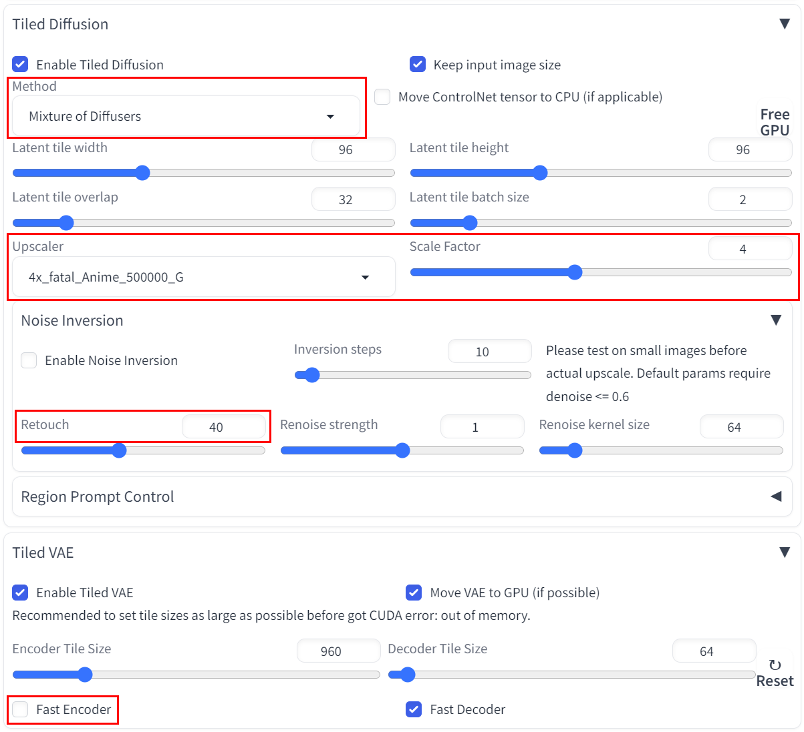

# 使用 LCM 和 Tiled Diffusion & VAE 插件实现 NAI V3 生成图片精修与超分
***
## 概述
本文使用 SD WEBUI 的 Tiled Diffusion & VAE 插件与LCM技术，实现了对NAI V3生成的图像的精修与超分。利用LCM技术和 Tiled Diffusion & VAE 插件，可以以较短的时间得到高质量的图片。
## NAI V3
NAI V3 , 全称 Novel AI Anime Diffusion V3 ，是 Novel AI 在2023年11月14日正式发布的第三代 NAI Anime Diffusion 模型。该模型在 SDXL 基础上进行训练，是目前效果最为出色的 SDXL 二次元模型。  
虽然只使用 NAI V3 可以获得非常好的图片，但是图片仍有许多肉眼可见的细节问题。同时，出于SDXL的底层设计和 NAI 的限制，得到的图片分辨率可能不是我们预期的大小。我们可以利用一些处理来对原图片进行精修和超分。  

## Tiled Diffusion & VAE 插件
Tiled Diffusion & VAE 插件是由 Github 用户 pkuliyi2015 等人共同开发的 SD Webui 插件。该插件提供的功能相当丰富且实用。  
本文只介绍我们主要使用的功能，且不会对具体原理进行讨论。  
更多相关内容请阅读该 REPO 下的数个 Markdown 文档，以便您更好理解本文的内容甚至发现本文当中的不足之处。  
Github Repo地址：  
https://github.com/pkuliyi2015/multidiffusion-upscaler-for-automatic1111  

## LCM
LCM 是最近非常流行的 SD 加速技术，本文主要使用的是 LCM LoRA 和 LCM 采样器。  
详情使用方式可以观看秋叶的视频介绍：  
https://www.bilibili.com/video/BV1Q94y1E7uc

## 参数表  
正向提示词：  
(masterpiece, best quality, highres:1.2),  
<lora:neg4all_bdsqlsz_V3.5:1> <lora:LCM_LoRA_Weights_SD15:1>  

使用了来自青龙圣者的 Neg4All LoRA 和适用于 SD 1.5 的 LCM LoRA 。  
Neg4All LoRA 地址：  
https://civitai.com/models/102356/neg4allboth-positive-high-qualitydetails-and-negative-worse-qualitybad-hand-in-one-lora  

逆向提示词：  
(worst quality, low quality:1.4),  

采样器：LCM 或 Euler （使用 Noise Inversion 时，采样器将被强制替换为 Euler ，不会过度影响 LCM 使用）  

CFG Scale： 1 ~ 1.5  
使用LCM时CFG必须低于2，否则会导致烧图等现象。  

Denoising strength：< 0.3  
二倍放大时，Denoising strength 应当 < 0.25。  
超出推荐值可能会导致图片被过度修改。  

Tiled Diffusion & VAE 插件参数：  
参数如下图所示。  
  
Latent Tile Size 应当根据您使用的 SD Checkpoint 进行调整。本文效果图使用的 SD Checkpoint 为作者个人融合的未公开模型，属于SD 1.5模型。  
通常而言，您应当提前了解您使用的模型的最适分辨率，并将最适分辨率 / 8 得到 Latent Tile Size。  
Overlap 根据插件作者和其他使用者推荐，采用32或48是最为合适的大小。  
Batch Size 请根据您的显存大小和放大倍数（Scale Factor）进行调整。  
Upscaler 和 Scale Factor 应当保证最适匹配，例如 4X 的 Upscaler 应当使用 Scale Factor 4进行四倍放大而不是二倍放大。  
Noise Inversion 可以在高 Denoising strength（尤其是超出推荐值）和高分辨率（根据插件作者描述，在8K分辨率下的情况）时产出更加忠于原图的结果图。但由于通常情况下我们无需8K级别分辨率的图像，所以仅在需要高还原度的情况下使用。
根据热心用户的建议，对于二次元图像默认的配置已经是最适配置。可以通过提高 Retouch 来增强二次元画风的效果，最适值与实际原理尚未考证。  
不建议在使用 LCM 进行加速时使用 Region Prompt Control 来进行局部修正。因为 LCM 会破坏生图质量，会直接导致被修补区域模糊。可以通过 Dynamic Thresholding 插件进行 CFG 修复进行一定程度弥补，但会导致显存需求更进一步提升。  

## 参考图
本文效果图使用的 Checkpoint 为作者个人融合的 FP16 未公开模型，VAE 为 Anythings VAE 。  
由于使用 Anythings VAE 的原因，图片的白底会变为灰底。可以使用 Blessed2 VAE 解决这个问题。  
本文所使用的实验设备为 2021 年款联想拯救者 R9000P，GPU 为英伟达 RTX 3060 Laptop 6GB。Cross attention optimization 使用 SDP 。Token Merging ratio 为 0.4 ，Negative Guidance minimum sigma 为 0.5 。  
原图如下图所示。  
  
使用 2x-sudo-RealESRGAN Upscaler进行二倍放大处理，处理用时 34.2 sec ，得到结果图如下图所示。  
  
使用 4x_Fatal_Anime 进行四倍放大处理，处理用时 2 min. 41.2 sec ，得到结果图如下图所示。  
  

## 其他参考图
  
  

## 优点
1. 该方法可以使用较少的时间完成高分辨率的超分和精修。  
2. 该方法使用较少的显存实现高分辨率的精美图片出品。  
3. 经过精修之后， NAI V3 生成图片当中的大部分细节可以被很好修复，尤其是错乱的线条或色块等细节缺损情况。  
4. 可以配合其他 WEBUI 插件进行更进一步的优化。  

## 缺点
1. 使用该方法超分**基本会导致图片产生一定细节变化**，变化程度根据 Denoising strength 、放大倍数和其他参数共同决定。**由于该问题的存在，图片可能会出现明显的细节缺陷**，详情见参考图部分四倍放大处理结果图。    
2. 画面颜色与部分细节直接由 VAE 所控制，**可能会导致颜色差异**。效果见参考图部分二倍放大处理结果图。  
3. 无法使用 Inpainting 模型进行超分。    
***  
## 致谢名单
1. Novel AI，提供了 NAI Anime Diffusion 系列模型。
2. AUTOMATIC1111 等人，开发了 AUTOMATIC1111 Stable Diffusion web UI。  
3. Pkuliyi2015 等人，开发了 Tiled Diffusion & VAE 插件。
4. 青龙圣者，制作了 Neg4All LoRA 。  
5. LCM 以及 LCM LoRA 的贡献者们，开发了 LCM：  
  
