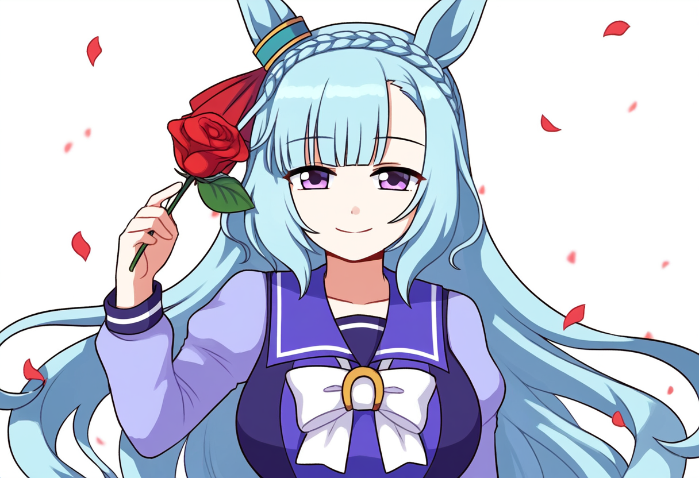
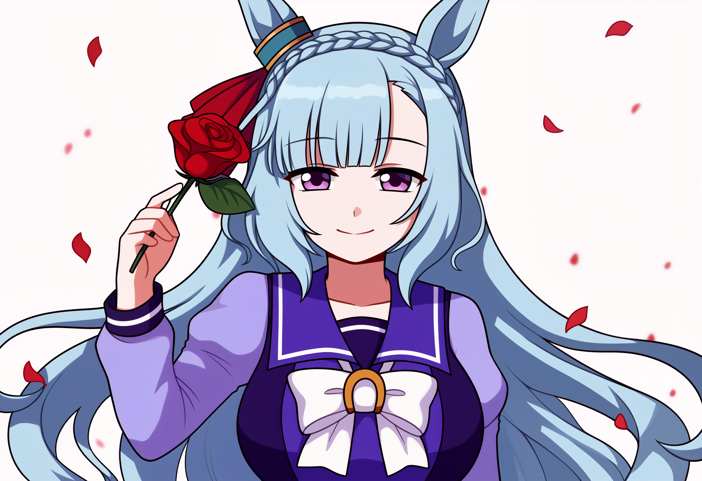
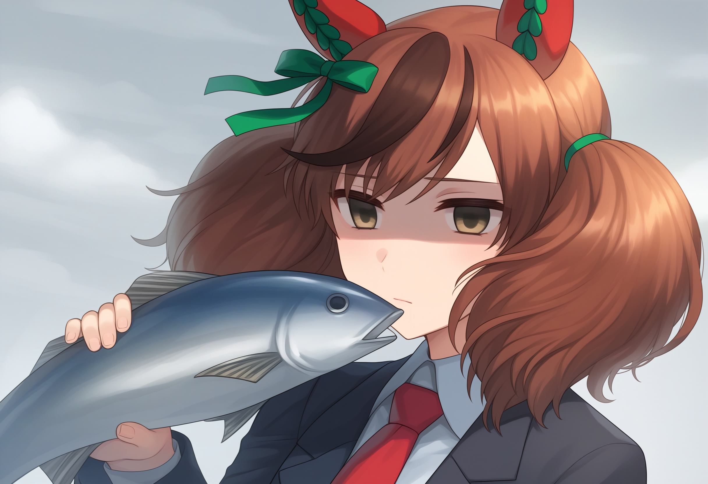
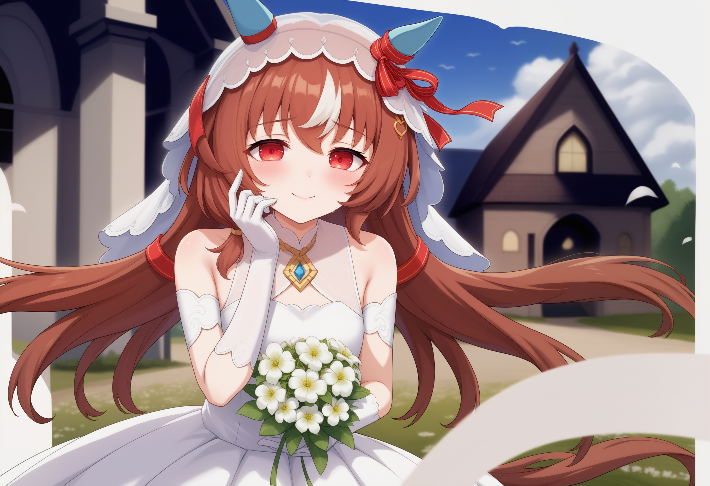

# 基于LCM实现的图片精修与超分
***
## 概述
本文使用 SD WEBUI Forge 的 多数插件与LCM技术，实现了对NAI V3生成的图像的精修与超分。利用LCM技术和WEBUI Forge的多数插件，可以以较短的时间得到高质量的图片，可以做到基本消除生成缺损等AI生成图片的细节问题。  

## NAI V3
NAI V3 , 全称 Novel AI Anime Diffusion V3 ，是 Novel AI 在2023年11月14日正式发布的第三代 NAI Anime Diffusion 模型。该模型在 SDXL 基础上进行训练，是目前效果最为出色的 SDXL 二次元模型。  
虽然只使用 NAI V3 可以获得非常好的图片，但是图片仍有许多肉眼可见的细节问题。同时，出于SDXL的底层设计和 NAI 的限制，得到的图片分辨率可能不是我们预期的大小。我们可以利用一些处理来对原图片进行精修和超分。  

## Tiled Diffusion & VAE 插件
Tiled Diffusion & VAE 插件是由 Github 用户 pkuliyi2015 等人共同开发的 SD Webui 插件。该插件提供的功能相当丰富且实用。  
本文只介绍我们主要使用的功能，且不会对具体原理进行讨论。  
在WEBUI Forge当中，该插件已经被内置且取消了部分不必要功能。**由于Forge内置的Tiled Diffusion插件不会跟原插件一样先进行超分，请提前使用Extra内的超分器进行超分**。  
更多相关内容请阅读该 REPO 下的数个 Markdown 文档，以便您更好理解本文的内容甚至发现本文当中的不足之处。  
Github Repo地址：  
https://github.com/pkuliyi2015/multidiffusion-upscaler-for-automatic1111  

## LCM
LCM 是一种 SD 加速技术，其原理是根据噪声其潜在的一致性来加速生成。同理，利用潜在一致性可以更好修复图片的缺损问题。    
详情使用方式可以观看秋叶的视频介绍：  
https://www.bilibili.com/video/BV1Q94y1E7uc

## Pony XL模型  
Pony XL是Pony Diffusion V6 XL模型及其衍生模型的简称。Pony Diffusion V6 XL模型是基于SDXL架构，从零开始自主训练的二次元模型。  
其生成水平可以与NAI V3相提并论，但由于其训练当中存在的部分问题，仍旧有一些严重的缺损等实际问题存在。  
本文使用的基底模型为Hassaku XL V1.3，是Pony XL系列模型当中对部分情况有特化修复的模型。  
模型地址：https://civitai.com/models/376031/hassaku-xl-hentai  

## 参数表  
本文由于LORA文件名等原因，会忽略所使用的LORA模型。本文建议使用且只使用LCM-LORA。  
正向提示词：  
(score_9, score_8:1.2),    

逆向提示词：  
(score_4, score_5:1.4), (realistic, lip, nose, tooth, rouge, lipstick, eyeshadow:1.0), (abs, muscular, rib:1.0),  

采样器：LCM，Schedule type：Automatic

CFG Scale： 1 ~ 1.5  
使用LCM时CFG必须低于2，否则会导致烧图等现象。  

采样步数：16  
经过测试，16为最适且LCM采样完全的步数。合适的步数可以避免LCM一定程度的模糊问题。  

Denoising strength：< 0.3  
二倍放大时，Denoising strength 应当 < 0.25。  
超出推荐值可能会导致图片被过度修改。   

Tiled Diffusion 参数为默认参数，Method只建议使用Mixture of Diffusers。  

## 针对图像过于锐利的处理方案  
在精修图片时，可能会出现图像过于锐利的问题。该问题可以利用Resharpen插件进行修复。  
Resharpen插件是Haoming02开发的WEBUI插件之一，正如其名是专门用于对图片进行锐化或者钝化的插件。  
Sharpness参数为正数时会锐化图片，负数时会钝化图片。通常建议数值取-0.2最佳。  
详情请参阅原项目地址：  
https://github.com/Haoming02/sd-webui-resharpen  

## 针对色彩的处理方案  
在使用本地环境生成图片和精修图片时，可以使用一些插件进行色彩的调整达到更好的效果。  
本文推荐使用Diffusion CG插件和Vectorscope CC插件。这两个插件都是用于色彩调整的WEBUI插件。  
由于具体调色方案没有通用的解决方法，故本文不会推荐具体参数配置。请用户自行根据需要调配。  
详情请参阅原项目地址：  
https://github.com/Haoming02/sd-webui-diffusion-cg  
https://github.com/Haoming02/sd-webui-vectorscope-cc  

## 参考图
本文效果图使用Hassaku XL V1.3。   
本文所使用的GPU 为英伟达 RTX 4060 Laptop 8GB。Token Merging ratio 为 0.4 ，Negative Guidance minimum sigma 为 0.5 。  
原图如下图所示。  
  
使用 4x_Fatal_Anime 进行二倍放大处理，得到结果图如下图所示。  
  
使用 4x_Fatal_Anime 进行四倍放大处理，得到结果图如下图所示。  
  

## 其他参考图
  
  

## 优点
1. 该方法可以使用较少的时间完成高分辨率的超分和精修，具体根据本地实际情况进行调整。  
2. 该方法使用较少的显存实现高分辨率的精美图片出品，具体可以根据本地情况进行调整。  
3. 经过精修之后， NAI V3 生成图片当中的大部分细节可以被很好修复，尤其是错乱的线条或色块等细节缺损情况。  
4. 可以配合其他 WEBUI 插件进行更进一步的优化。  

## 缺点
1. 使用该方法超分**会导致图片产生一定细节变化**，变化程度根据 Denoising strength 、放大倍数和其他参数共同决定。**由于该问题的存在，图片可能会出现明显的细节缺陷**。在Pony XL当中**该问题不再明显，与原图相比可以做到无视具体差异**。    
2. 画面颜色与部分细节直接由 VAE 和插件配置所控制，**可能会导致颜色差异**。效果见参考图部分结果图。  
3. 使用Diffusion CG时极其容易出现图像偏色问题，请自行调整参数。    
***  
## 致谢名单
1. Novel AI，提供了 NAI Anime Diffusion 系列模型。
2. AUTOMATIC1111 等人，开发了 AUTOMATIC1111 Stable Diffusion web UI。  
3. Pkuliyi2015 等人，开发了 Tiled Diffusion & VAE 插件。
4. lllyasviel，开发了WEBUI Forge。
5. Haoming02，开发了本文当中使用的其他插件。  
6. LCM 以及 LCM LoRA 的贡献者们，开发了 LCM：  
  
